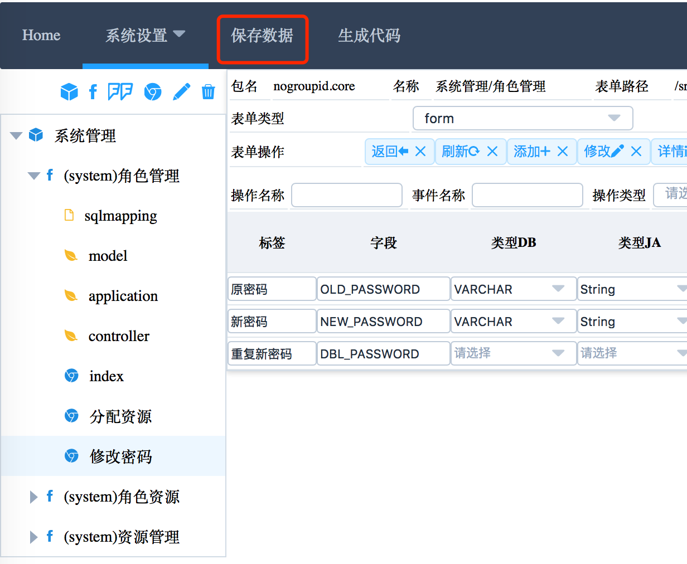

QDP Overview
====

## 平台的功能结构

为了提供更大的使用便利，平台目前采用本地运行的方式，可以在本机上运行代码生成平台快速生成平台代码。

-------

##1. 构建工程

###1.1 下载工程模板

下载地址：[QDP 4.0.0](http://120.26.82.66:9090)

###1.2 导入工程模板

下载工程模板后：

1. 解压
2. 修改项目名称（pom.xml）
3. 先使用Maven构建：mvn clean package
4. 运行应用(Springboot)：java -jar target/foss-qdp-project-v4-4.0.0.war
5. 再导入Eclipse

###1.3 使用设计器生成代码

####1.3.1 运行设计器

打开类：com.foreveross.common.util.StartQdpDesignerServer，运行本类，默认的端口：2020。

访问地址：[http://localhost:2020/index.html](http://localhost:2020/index.html)

####1.3.2 配置项目信息 (系统设置->项目根路径)

1. 项目根路径：工程导入的根路径。**路径下必须要有pom.xml**
2. 工程：工程名称，对应maven的artifactId。
3. 包名：工程包名，对应maven的package。
4. 版本：工程版本，对应maven的version。
5. 代码模板版本：1.0.0-vue2-elementui1.3.5

**注意**：上面的配置并不会自动修改pom.xml中的配置，请自行修改。

####1.3.3 导入已有表结构 (系统设置->数据库连接)

1. JdbcUrl：jdbc url。**目前只支持MYSQL数据库**
2. UserName：用户名。
3. Password：密码。
4. 删除：按确定后会加载数据库的表，也可以删除。**删除的表不会影响已经引用的表**

####1.3.4 添加模块

1. 名称：模块的中文名称，如：系统管理。
2. 包名：模块的包名，如：core。**必须符合JAVA包名规范**

####1.3.5 添加功能

先要选择具体的模块，点击添加功能图标：

1. 名称：功能的中文名称，如：用户管理。
2. 包名：功能的包名，如：system。**必须符合JAVA包名规范**

点击index，这节点表示index页面，及主表的配置。**必须点开一下**（其他节点功能未实现）

####1.3.5 批量添加功能

先要选择具体的模块，点击批量添加功能图标：

选择要添加的模块：

选择完成后自动生成模块：

需要修改模块的 **名称** 及 **包名** 各模块 **必须点开一下**：

先要选择具体的功能，点击编辑图标（该图标可以编辑选中的任何节点）：

1. 名称：功能的中文名称，如：用户管理。
2. 包名：功能的包名，如：system。**必须符合JAVA包名规范**

####1.3.6 功能配置说明

##### 1.3.6.1 绑定Table：新增Table时可配置，添加功能时不选择表，就可以配置该项，用于新增Table。

##### 1.3.6.2 表单类型：可选值有，

		grid：当前页面以分页列表显示
		tree：当前页面以树型显示，表/数据结构需要有字段['TYPE1','TYPE2']或['ROOT_ID','PARENT_ID']
		selectOneGrid：当前页面以弹出分页列表显示，只可以选择一条记录，**不要在index上设置**
		selectOneTree：当前页面以弹出树型显示，只可以选择一条记录，**不要在index上设置**
		selectMultiGrid：当前页面以弹出分页列表显示，可以选择多条记录，**不要在index上设置**
		selectMultiTree：当前页面以弹出树型显示，可以选择多条记录，**不要在index上设置**
		form：当前页面以弹出外置表单显示，触发表单显示需要在表单操作上添加操作，操作事件名称为当前页面的文件名，会对应生成vo，及空的application方法，可以在页面上添加方法的代码，**不要在index上设置**
		domainOnly：当前页面如果对应的是一个中间表，或只想生成domain代码，其他页面及代码不生成
		noShow：在设置关联表时，设计器会生成中间操作页面，但不需要显示，可以设置该项，例如：在树型结构中存在ROOT_ID，PARENT_ID，现在添加节点的操作方式是选择树节点进行添加叶子，也就是不允许在添加树节点时选择上级节点，也不允许必应上级节点，那么ROOT_ID，PARENT_ID对应的中间操作页面就不需要显示，需要设置为noShow

##### 1.3.6.3 表单操作：

		表单操作：表单操作默认的列表，选择树型及列表会有不同的操作列表
		可以添加或删除表单操作：
		操作名称：中文名称，**必须**
		事件名称：对应是上面表单类型的form的文件名称，当点击操作时会触发事件，弹出事件名称对应的表单，**必须**
		操作类型：只选择modal，其他的可以参看已经有表单操作，**必须**
		操作图标：可以选择操作的图标，**必须**
		快捷键  ：可以配置快捷键，按Ctrl+键可以直接触发，默认已经使用：B|R|A|E|I|D

##### 1.3.6.4 字段设置：	

		标签：中文名称，会生成字段的注释，**必须**
		字段：字段名称，必须大写，使用下划线分隔的形式，自动按分割线转驼峰命名，**必须**
		类型DB：数据库类型，非数据库字段也要选择，**必须**
		类型JA：Java类型，**必须**
		长度：Varchar及数字精度类型需要指定
		精度：精度类型需要指定
		默认值：数据库字段默认值
		为空：是否为空，默认为否
		主键：是否为主键，默认为否
		索引：是否创建索引，默认为否
		唯一：是否唯一，默认为否
		自增长：是否使用自增长，默认为否，**强烈建议不要使用自增长ID**
		非表列：是否创建数据库表字段，默认为否，对应不生成数据库字段一定要勾上，**注意**
		序号：该序号可以调整字段的顺序，**必须**
		描述：字段的描述，默认与标签相同即可，**必须**
		控件：字段的默认显示类型，表单显示时使用，值有：text|textarea|password|radio|checkbox|switch|select|date|time|cascader|number|rate|file|modal|label|icon
		配置：字段的详细配置
		操作：可以添加已经删除字段

##### 1.3.6.5 字段配置

1.3.6.5.1. 字段配置-CRUD：

		添加：添加表单是否显示该字段，建议主键、描述、创建时间、更新时间不要显示
		修改：修改表单是否显示该字段，建议主键、描述、创建时间、更新时间不要显示
		列表：分页列表是否显示该字段，建议主键不要显示
		详情：详情表单是否显示该字段
		搜索：该字段是否用于搜索，目前分页列表页面只显示前三个搜索条件，弹出列表只显示前两个搜索条件，设置为搜索的字段串类型字段，会自动生成模糊匹配
		排序：是否用于排序，建议只用于搜索条件上

1.3.6.5.2. 字段配置-控件：

		搜索：在搜索表单时显示表单类型，默认使用外面统一设置的类型
		添加：在添加表单时显示表单类型，默认使用外面统一设置的类型
		修改：在修改表单时显示表单类型，默认使用外面统一设置的类型
		列表：在列表表单时显示表单类型，默认使用外面统一设置的类型
		详情：在详情表单时显示表单类型，默认使用外面统一设置的类型

1.3.6.5.3. 字段配置-验证：

		验证用于前端页面的验证规则。
		字段类型：在提交表单时检查字段类型是否匹配
		是否必须：在提交表单时检查字段类型是否必须有值，可自定义提示消息，默认会弹出生成提示消息
		正则表达式：在提交表单时检查字段类型是否匹配表达式，可自定义提示消息，默认会弹出生成提示消息
		范围：Min，Max，在提交表单时检查字段的数字范围或字段串长度，可自定义提示消息，默认会弹出生成提示消息	
		长度：在提交表单时检查字段的字段串长度，可自定义提示消息，默认会弹出生成提示消息
		枚举：在提交表单时检查字段的值是否在枚举值内，提供JSON格式数据，可自定义提示消息，默认会弹出生成提示消息	
		无空白字符	：在提交表单时检查字段的值是否有空白字符，可自定义提示消息，默认会弹出生成提示消息	

1.3.6.5.4. 字段配置-引用：

这里以角色-资源的关系说明引用的使用，下面有三张表，角色管理、资源管理及角色资源中间表：

现在，要在角色的表单中分配资源，1）先在角色管理中添加列RESOURCE_ID，设置为非表列（只在VO中有该字段），设置控件为modal（弹出选择框）：

2）点击配置，选择引用页：

		下面的配置会对应生成弹出选择的页面，以及对应的Application、Domain中分配的方法（以assign开头的方法）
		引用表：RESOURCE_ID对应的表
		引用字段：RESOURCE_ID对应的表的主键
		标签字段：RESOURCE_ID对应的表的名称字段，显示时看到的是名称字段
		中间表：角色与资源的关联的中间表，有些表是直接外键关联，那就不用选择本列的所有项
		主表关联字段：主表就是表示当前的表，也就是角色表，关联字段就是就是主表的主键
		从表关联字段：从表就是RESOURCE_ID对应的表，也就是资源表，关联字段就是就是从表的主键
		

3）配置完成后，（该页面关闭会触发）生成如下内容，需要选择resourceId页面，编辑其名称，**不要改其文件名**，表单类型根据具体情况可以具体选择，点击该页面的字段配置，可以控制其列表显示及搜索内容【见字段配置-CRUD】，修改其他内容不会改变对应表的配置，**建议不要删除字段**，**对应的表结构改变不会改变这里的内容，需要删除本页，打开配置页面，再关闭即可重新生成**。

1.3.6.5.5. 字段配置-其他：

		这里可以配置一些字段杂项：
		宽度：字段在列表中显示的宽度
		换行：字段在列表中是否允许换行
		URL：字段的数据来源，主要用于下拉选择，未实现
		DATA：字段的数据，主要用于下拉选择，JSON格式，KEY：NAME的形式，配置这个也会在Domain中生成校验，字段的值必须是JSON中的KEY
		可选DATA：内置的下拉选择

1.3.6.5.6. 字段配置-扩展：

		字段的扩展设置：
		DATA：JSON形式的数据，主要是用于代码生成时，一些字段的特殊属性

##### 1.3.6.6 外置表单

外置表单是用于非关联表单，也就是设计器不会自动给生成的表单页面，这就需要手动添加外置表单，也就是：表单类型=form。

1.3.6.6.1. 选择一个功能，点击添加页面

1.3.6.6.2. 填写页面的名称及文件名，**都不能为空**

设计器会生成文件名的页面，以及文件名的Application方法（空方法），所以文件名需要 **符合JAVA方法命令规范**

1.3.6.6.3. 添加表单字段，**都不能为空**

		点击上面创建的表单
		绑定TABLE：**注意**，如果填写该值会创建数据库表，如果只是VO表单，则不要填写该项
		表单类型：外置表单值需要选择为form，如果是想创建数据表，则要选择grid或tree
		添加代码：当表单类型为form时，可以添加代码，该代码会直接填充到对应文件名的Application方法中
		非表列：当表单类型为form时，记得把非表列勾选上

##### 1.3.6.7 创建数据库表

参见：1.3.6.6 外置表单

####1.3.7 保存数据

点击保存数据，配置会以JSON形式保存项目的根路径下（与pom.xml同目录），以.qdp_config文件命名。

####1.3.8 生成代码

保存数据后，点击生成代码，可以生成项目代码及数据库脚本，生成的代码不会自动覆盖已有代码文件，如果文件已经存在则新生成的代码会以.qdpgen文件名结尾，需要手动合并。

生成的代码内容包括：

####1.3.9 添加package扫描

添加Spring扫描的package，如果忘记添加Spring会不加载package下的类。

		META-INF/spring/root.xml
		META-INF/spring-app/spring-data-access.xml
		META-INF/spring-web/spring-servlet.xml

